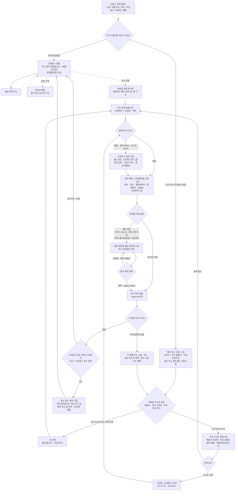

# [초안] Flow B · 주소지 입력 퍼널

> 대상: **O2H 통합 비교견적 플로우(Flow B)** 의 `서비스 선택` → `입력폼` 사이에 들어갈 주소지 퍼널
> 참조: 이사 신청폼 주소지 퍼널 (Figma 9470-79517 · 9470-80650 · 9470-79228/79658 · 9478-116171/117053 · 9445-86626 · 9445-86334 · 9450-88777)
> 상태: **프로토타입 반영 전 설계 예시.** 확정 후 `POLICY_FlowB_입력폼_오더카드.md` A절을 갈아끼운다.

---

## 0. 목표와 원칙

공통 항목은 **최소한만 묻고**, 배송지 정보로 **입력 허들을 낮춘다.** 여기서 나오는 세 가지 원칙이 아래 모든 판단의 기준이다.

1. **묻지 않고 아는 것부터 채운다.** 주소 하나가 확정되면 평수·층수·엘리베이터·방 구조는 조회로 얻는다. 조회에 실패한 항목만 묻는다.
2. **배송지는 후보이지 확정값이 아니다.** 배송지가 시공지일 수도, 이사 출발지일 수도 있다. 자동으로 넣지 않고 **리스트 맨 위에 올려 사용자가 고르게** 한다.
3. **같은 집을 두 번 묻지 않는다.** 시공지·이사 도착지·청소 장소는 대개 같은 집이다. 한 번 확정하면 나머지는 승계하고, 다를 때만 바꾸게 한다.

> 현재 프로토타입은 배송지를 시공지에 곧바로 박아넣는다. 틀렸을 때 되돌릴 방법이 주소 수정뿐이라 원칙 2에 어긋난다. 이 퍼널이 들어오면 배송지는 '가장 위에 놓인 후보'가 되고 확정은 사용자가 한다.

---

## 1. 참조 플로우에서 가져온 것과 바꾼 것

| 항목 | 이사 신청폼 (참조) | Flow B (이 초안) | 이유 |
|---|---|---|---|
| 받는 주소 개수 | 출발지·도착지 **2개 고정** | 서비스 조합에 따라 **1~2개** | 시공만 고르면 시공지 하나로 끝난다 |
| 진행률 | 28.6% → 37.5% → 42.9% **고정 퍼센트** | **`n/N` 스텝 표기** | 조합마다 전체 스텝 수가 달라 퍼센트를 고정할 수 없다 |
| 저장된 주소 리스트 | 배송지 + 시공지 | 그대로 | — |
| 상세주소 스텝 | 신설 · 풀스크린 | 그대로 | — |
| 조회 항목 | 층수 · 평수 · 엘리베이터 | **+ 방·베란다 개수 · 화장실 개수** | Flow B 이사청소 카드가 쓰는 값이다 |
| 엘리베이터 인풋 | 디자인에 없음(갭) | **결손 인풋에 추가** | 이사 견적의 사다리차 여부를 가른다 |
| 컨펌 화면 | 별도 화면 (9445-86334) | **기존 입력폼이 컨펌을 겸한다** | 화면을 하나 더 만들지 않고 예정일까지 같은 자리에서 받는다 |
| 복층 여부 | 체크 제거 | 그대로 없음 | — |

---

## 2. 서비스 조합별 주소 스텝

**앵커 주소**를 하나 정하고 나머지는 승계한다. 앵커 순서는 기존 정책과 같다 — **시공지 > 이사 출발지 > 이사 도착지**.

| 선택 서비스 | 직접 받는 주소 | 승계로 채우는 주소 | 스텝 |
|---|---|---|---|
| 종합시공 / 부분시공 | 시공지 | — | **1** |
| 이사 | 이사 출발지 · 이사 도착지 | — | **2** |
| 이사청소 | 청소 장소 | — | **1** |
| 시공 + 이사 | 시공지 · 이사 출발지 | 이사 도착지 ← 시공지 | **2** |
| 시공 + 이사청소 | 시공지 | 청소 장소 ← 시공지 | **1** |
| 이사 + 이사청소 | 이사 출발지 · 이사 도착지 | 청소 장소 ← **선택** (A-1) | **2** + 선택 |
| 시공 + 이사 + 이사청소 | 시공지 · 이사 출발지 | 이사 도착지 ← 시공지 · 청소 장소 ← **선택** (A-1) | **2** + 선택 |
| 인터넷 / 렌탈만 | — | — | **0** (퍼널 건너뜀) |
| 인터넷·렌탈 + 위 조합 | 위와 동일 | 설치 주소 ← 앵커 주소 | 위와 동일 |

- **이사 출발지는 승계 대상이 아니다.** 지금 사는 집이라 시공지·도착지와 다르다. 다만 배송지가 지금 사는 집일 확률이 높아 **리스트 1순위 후보**가 된다.
- 승계된 주소는 컨펌(입력폼)에서 `시공지와 동일`로 표기하고, 탭하면 개별 주소로 풀어 바꿀 수 있다.
- **주소를 새로 묻는 것은 최대 2번이다.** 시공·이사·이사청소를 다 골라도 주소 입력은 두 번이다.

### A-1. 이사청소 장소는 짧게 묻는다

이사청소는 **입주 청소(새 집)** 와 **퇴거 청소(지금 사는 집)** 둘 다 있어서 승계 방향을 정할 수 없다. 그래서 **이사와 이사청소를 함께 고른 경우에만** 두 후보를 놓고 한 번 묻는다.

| 조합 | 청소 장소 후보 | 처리 |
|---|---|---|
| 이사청소 단독 | 1개 (그 주소) | 묻지 않는다 |
| 시공 + 이사청소 | 1개 (시공지) | 묻지 않고 승계 |
| 이사 + 이사청소 | 2개 (도착지 · 출발지) | **묻는다** |
| 시공 + 이사 + 이사청소 | 2개 (시공지 · 출발지) | **묻는다** |

후보가 하나뿐이면 묻지 않는다. 주소를 새로 받는 스텝이 아니라 **이미 받은 주소 중 하나를 고르는 스텝**이라 입력 부담이 없다.

---

## 3. 퍼널

---

## 4. 화면별 명세

### S1. 앵커 주소 스텝 (`1/N`)

| 구성 | 내용 |
|---|---|
| 헤더 | 뒤로 · `n/N` |
| 타이틀 | 시공지: **"시공할 집 주소를 알려주세요"** / 이사 출발지: **"어디에서 출발하세요?"** / 청소 장소: **"청소할 집 주소를 알려주세요"** |
| 서브 | **"주소만 알면 평수·층수를 알아서 채워드려요"** |
| 검색 필드 | 항상 상단 고정. 탭하면 S2 바텀시트 |
| 리스트 | 저장된 주소 최대 5개. 배송지 최상단 + `배송지` 뱃지 |
| CTA | 없음. 리스트 선택 또는 검색 완료가 곧 다음 스텝 |

**리스트 규칙** — 배송지 · 과거 시공지 · 과거 이사 주소를 합쳐 최근 등록순 5개. 도로명+동+호가 같으면 병합하고 라벨은 화이트리스트(`집`·`회사`·`배송지`) 외 숨긴다. 두 번째 스텝에서는 **앞서 고른 주소를 리스트에서 제외**한다.

**빈 상태 (0건 12.5% · 조회 실패)** — 리스트 자리에 **"아직 등록한 주소지가 없어요"** 만 두고 검색 필드에 오토포커스한다.

### S2. 주소 검색 바텀시트

우편번호 + 도로명 + 지번을 한 줄에 묶어 보여준다. 기본 상태는 안내 문구, 입력 시작하면 결과 리스트로 바뀐다. 검색으로 들어오면 **상세주소가 100% 비어 있으므로** 선택 직후 항상 S3로 간다.

### S3. 상세주소 입력 스텝

풀스크린 단독 화면이다. 고른 도로명을 상단에 고정해 보여주고 상세주소 인풋 하나만 둔다. 키보드를 즉시 올리고 확인은 값이 들어올 때까지 비활성이다.

- 타이틀: **"상세주소를 입력해주세요"**
- 예시 플레이스홀더: `101동 1201호`
- 리스트에서 들어온 경우 **동은 57.1%, 호는 84.0%** 가 이미 있어 이 스텝을 건너뛴다. 리스트 진입 기준 **42.9%** 만 이 화면을 본다.

### S4. 조회 (로딩)

도로명 + 동 + 호가 확정된 직후 **1회만** 실행한다. 타임아웃 3초.

| 항목 | 소스 | 쓰이는 곳 |
|---|---|---|
| 평수 | 단지 structures | 입력폼·전 서비스 카드 · 견적 기준가 |
| 층수 | 건축물대장 | 이사 (사다리차) |
| 엘리베이터 | O2O 단지 정보 | 이사 카드 |
| 방·베란다 개수 | 단지 structures | 이사청소 카드 |
| 화장실 개수 | 단지 structures | 이사청소 카드 |

문구는 현재 로딩 화면을 그대로 쓴다 — **"예상 견적 계산에 필요한 정보를 구성 중이에요 / 주소지 정보를 불러오고 있어요..."**

### S5. 결손 입력

조회가 **부분 실패**했을 때만 같은 화면에 **실패한 항목만** 덧붙인다. 주소 입력값은 유지한다. 실패 사유는 단지 미매칭 54.2%, 후보 5개 이상, 오피스텔·주상복합, 타임아웃이다.

| 항목 | 필수 여부 | 인풋 |
|---|---|---|
| 평수 | **항상 필수** | 드롭다운 (10평 이하 ~ 50평대) |
| 층수 | 이사 선택 시 필수, 그 외 선택 | 드롭다운 |
| 엘리베이터 | 이사 선택 시 필수 | **있음 / 없음** (참조 디자인의 갭 — 이번에 추가) |
| 방·베란다 개수 | 이사청소 선택 시 필수 | 스텝퍼 또는 드롭다운 |
| 화장실 개수 | 이사청소 선택 시 필수 | 드롭다운 |

필수가 다 차기 전까지 확인은 비활성이다. 직접 채운 값은 `origin=USER` 로 기록한다.

### S5-2. 청소 장소 선택 (이사 + 이사청소 동시 선택 시에만)

주소를 새로 받지 않고 **이미 확정한 두 주소 중 하나를 고르는** 스텝이다.

- 타이틀: **"이사청소는 어느 집을 하나요?"**
- 보기 2개를 주소와 함께 리스트로 노출한다
  - `이사 들어갈 집` + 도착지(또는 시공지) 주소
  - `지금 사는 집` + 출발지 주소
- 고르는 즉시 다음으로 넘어간다. CTA 없음
- 후보가 하나뿐인 조합에서는 이 화면을 띄우지 않는다

### S6. 컨펌 = 입력폼

**별도 컨펌 화면을 만들지 않고 기존 입력폼이 그 역할을 한다.** 주소 퍼널에서 확정한 값을 카드로 보여주고, 여기서 **예정일만 추가로** 받는다.

- 확정된 주소·평수는 값이 채워진 행으로, 승계된 주소는 `시공지와 동일` 로 표기
- 조회에 실패했고 필수도 아니었던 항목은 **빈 값(null)을 유지**하고 값 자리에 `입력하기` 를 노출
- 각 행은 탭하면 편집 바텀시트로 열린다 (현재 구현과 동일)
- 하단 CTA: `예상 견적 보기`

---

## 5. 값의 출처 기록 (`origin`)

주소를 바꿨을 때 무엇을 지울지 판단하려면 값이 어디서 왔는지 알아야 한다.

| origin | 뜻 | 컨펌 표기 | 주소 변경 시 |
|---|---|---|---|
| `AUTO` | 조회로 채움 | 값 + 보조 캡션 없음 | **초기화** |
| `USER` | 사용자가 직접 채움 | 값 그대로 | **초기화** |
| `INHERIT` | 다른 주소에서 승계 | `시공지와 동일` | **초기화** |

- **주소를 바꾸면 상세주소·평수·층수·엘리베이터·방 구조를 모두 지우고 조회를 다시 돈다.** 다른 집의 값이 남아 있는 것이 가장 위험하다.
- **값만 수정하면** 주소와 다른 항목은 건드리지 않고 해당 값만 `USER` 로 바꾼다.
- 앵커 주소를 바꾸면 그 주소를 승계한 `INHERIT` 주소도 함께 따라 바뀐다.

---

## 6. 폴백

| 상황 | 처리 |
|---|---|
| 저장된 주소 0건 | 빈 상태 + 검색 오토포커스 (S1) |
| 주소 조회 API 실패 | 빈 상태와 동일하게 취급. 검색만 열어준다 |
| 단지 매칭 실패 · 타임아웃 3초 | 결손 입력으로 넘긴다 (S5). 로딩을 3초 이상 붙잡지 않는다 |
| 후보 단지 5개 이상 | 자동 확정하지 않고 결손 입력으로 넘긴다 |
| 오피스텔 · 주상복합 | 단지 structures 신뢰도가 낮아 평수를 직접 받는다 |
| 컨펌에서 평수가 비어 있음 | 값 자리에 `평수 정보 입력` CTA (참조 9450-88777) |

---

## 7. 확정되면 손볼 문서·코드

| 대상 | 변경 |
|---|---|
| `POLICY_FlowB_입력폼_오더카드.md` A절 | 입력폼 항목에서 주소를 빼고 이 퍼널을 참조하도록 교체. 입력폼은 **예정일 + 컨펌**만 담당 |
| 같은 문서 A-2 | 배송지 자동 확정 → **리스트 후보 제시**로 규칙 변경 |
| 같은 문서 B-2 | prefill 소스를 `O2H_ADDR_INFO` 목업에서 **조회 결과 + origin**으로 확장 |
| `o2o_prototype_ods.html` | `o2hSelect` → `o2hAddr`(신규 3스텝) → `o2hForm` 으로 라우팅 변경. `o2hPrefillAddrs` 를 승계·origin 규칙으로 대체 |

---

## 8. 확인이 필요한 것

1. **인터넷·렌탈 설치 주소** — 지금 초안은 앵커 주소를 승계하고 단독 선택 시에는 아예 묻지 않는다. 상담에서 확인하는 게 맞는지.
2. **층수·엘리베이터를 이사 미선택 시에도 받을지** — 지금은 이사에서만 필수다. 시공에서 자재 운반 때문에 필요하다면 필수 조건을 넓혀야 한다.
3. **진행률 표기** — 참조 플로우의 고정 퍼센트 대신 `n/N` 을 제안했다. 이사 신청폼과 표기를 통일해야 한다면 조합별 퍼센트 테이블이 필요하다.
4. **청소 장소 선택 스텝의 자리** — 지금은 주소 스텝 뒤에 독립 화면으로 뒀다. 컨펌(입력폼)의 청소 장소 행에 2개 칩으로 붙이면 화면을 하나 줄일 수 있다.

---

## 화면 예시

와이어프레임: `flowb_addr_funnel_wire.html` — 위 S1~S6 화면을 조건별로 모두 펼쳐 둔 정적 예시다.
