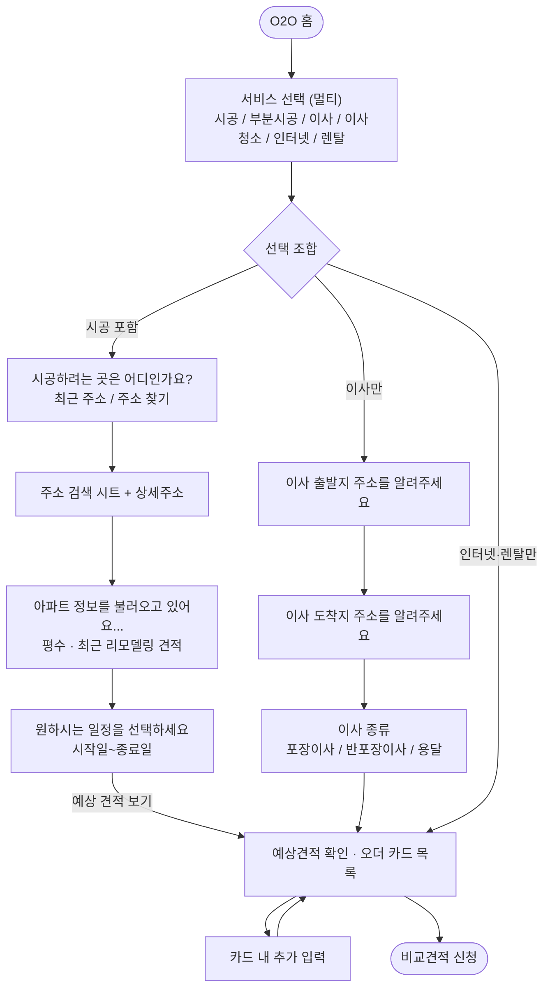

# Flow B · 입력폼 · 오더 카드 정책 문서

> 대상: **O2H 통합 비교견적 플로우(Flow B)** — `o2hHome → o2hSelect → o2hForm(주소·일정 퍼널) → o2hOrder → o2hApply`
> 코드 ground truth: `o2o_prototype_ods.html` 의 `o2hFunnelPlan` · `o2hStartFunnel` · `O2H_ORDER_FIELDS` · `O2H_EXTRA` · `O2H_FIELD_BRANCHES` · `O2H_CARD_BRANCHES`
> **이 문서는 Flow A(통합신청폼)와 독립적입니다.** Flow A의 챗봇 문항 매트릭스(`QMX`)와 총 예상 견적 정책은 `POLICY_신청폼_정보매트릭스.md` 에서 따로 관리합니다.

---

## 00. Flow B 플로우 개요

- Flow B는 **주소·일정을 스텝 퍼널로 받은 뒤** 예상견적 카드를 띄우고, 카드 안에서 항목을 **점진적으로 채우는** 구조다.
- 예전 입력폼 목록(평수·주소·예정일 행)은 쓰지 않는다. 서비스별 상세 문항은 **오더 카드 안의 추가 입력**으로 받는다.
- **알 수 있는 값은 묻지 않는다.** 시공지가 정해지면 평수·엘리베이터·방 구조를 조회하고, 이사 도착지·청소 장소를 승계한다. 배송지는 최근 주소 **후보**일 뿐 자동 확정하지 않는다.

---

## A. 주소·일정 퍼널

> 코드: `o2hFunnelPlan()` · `o2hStartFunnel()` · `o2hRenderPick` · `o2hSrchSheet` · `o2hRenderDetail` · `o2hRenderLoad` · `o2hRenderSched` · `o2hRenderMoveType`
> Figma: 시공 `12:3034` · `12:3051` · `12:3971` · `12:4085` / 주소 검색 `9470:79228` · `9470:79658` · `9478:116171`

### A-1. 조합별 스텝

| 선택 | 퍼널 | CTA 후 랜딩 |
|---|---|---|
| **시공 포함** (전체/부분, 이사·청소 동반 가능) | 시공지 선택 → (검색·상세주소) → 단지 조회 → 시공 일정(시작~종료) | `[예상 견적 보기]` → `o2hOrder` |
| **이사만** (시공 없음) | 출발지 → 도착지 → 이사 종류(포장/반포장/용달) | 종류 선택 즉시 `o2hOrder` |
| **이사청소만** | 청소 장소 주소 | 주소 확정 후 `o2hOrder` |
| **인터넷·렌탈만** | 없음 | 서비스 선택 다음 곧바로 `o2hOrder` |

- 시공을 포함하면 **이사 출발지는 퍼널에서 묻지 않는다.** 도착지·청소 장소는 시공지로 승계한다.
- 이사만 고르면 출발지·도착지를 **같은 UX**(최근 주소 + 주소 찾기)로 각각 받는다.

### A-2. 공통 주소 입력

1. **최근 주소** — 저장된 주소 최대 5개. 배송지는 `기본배송지` 뱃지로 맨 위 근처에 두되 **자동 선택하지 않는다.**
2. **주소 찾기** — Search Field 탭 → BottomSheet `주소 검색`. 빈 상태는 검색 예시, 입력 시작하면 우편번호+도로명+지번 결과(매칭어 하이라이트).
3. **상세주소** — 검색으로 고른 도로명(또는 상세가 없는 저장 주소)은 풀스크린에서 `상세 주소를 입력해주세요`. `[확인]` 은 값이 있을 때만 활성.
4. 저장 주소에 동·호가 이미 있으면 상세 스텝을 **건너뛰고** 조회 또는 다음 주소로 간다.

### A-3. 시공 조회·일정

- 시공지가 확정되면 **아파트 정보를 불러오고 있어요...** (평수 정보 · 최근 리모델링 견적) → **불러오기 완료!** (33평형 · 최근 리모델링 견적) 후 일정으로 넘어간다.
- 일정은 **시작일~종료일 범위**. 둘 다 고르면 `[예상 견적 보기]` 가 활성이다.

### A-4. prefill · 승계

- **배송지는 리스트 후보다.** 시공지·출발지에 자동으로 넣지 않는다.
- 시공지가 정해지면 평수·엘리베이터·방 구조를 조회해 채운다. 이사 도착지·청소 장소는 시공지와 같다.
- 시공 없이 이사만 있으면 청소 장소는 이사 도착지로 채운다.

---

## B. 오더 카드 상태 분기와 prefill

### B-1. 카드 상태 분기

| 분기 | 대상 서비스 | 카드 표시 |
|---|---|---|
| `draft` (작성중) | 시공 · 부분시공 · 이사 · 이사청소 | 공통 항목만 노출 · 추가 입력 열림 |
| `ready` (작성완료) | 시공 · 부분시공 · 이사 · 이사청소 · 렌탈 | 전체 항목 노출 · 추가 입력 닫힘 |
| `applied` (신청완료) | 종합시공 · 이사 | 신청완료 뱃지 · 추가 입력 닫힘 |
| `consult` (상담 후 확정) | 인터넷 · 렌탈 | 금액 없이 상담 후 확정만 표기 |
| `banner` (혜택 배너형) | 인터넷 | 카드 대신 설치 혜택 배너로 노출 |

- 항목 노출 범위는 `o2hFieldBranch(서비스)` 로 갈린다. `common`(기본) → 공통 항목만, `full`(전체) → C의 전체 항목까지.
- 인터넷·렌탈은 분기가 `basic` 하나뿐이라 항상 같은 항목을 노출한다.

### B-2. 주소지 기반 prefill

- **이사를 선택하면 주소지를 기준으로 `엘리베이터 유무`와 `평수`를 채운다.** 두 값 모두 사용자에게 묻지 않는 것이 기본이고, 카드에서 수정만 열어둔다.
- **이사청소의 `방·베란다 개수`와 `화장실 개수`도 주소지를 기준으로 채운다.**
- 조회에 실패한 항목만 `입력하기` 상태로 남겨 사용자가 직접 채우게 한다.

---

## C. 서비스별 카드 노출 항목

여기서 말하는 '노출 항목'은 **입력폼에서 받았거나 주소로 채운 값**이다. 카드에서 직접 받는 문항은 D가 행으로 덧붙는다.

| 서비스 | 공통 항목 (`common`) | 전체 항목 추가분 (`full`) |
|---|---|---|
| **종합시공** | 평수 · 시공지 | 예산 · 시공 예정일 |
| **부분시공** | 평수 · 시공지 | 예산 · 시공 예정일 |
| **이사** | 평수 · 출발지 · 도착지 | 이사 예정일 · 이사 유형 · 엘리베이터 |
| **이사청소** | 평수 · 청소 장소 | 청소 예정일 · 방·베란다 개수 · 화장실 개수 |
| **인터넷** | — (D의 3문항만 행으로 노출) | — |
| **렌탈** | — (D의 렌탈 품목만 행으로 노출) | — |

- **평수·주소·예정일은 주소·일정 퍼널에서 받은 값을 그대로 보여준다.** 카드에서 다시 묻지 않고 수정만 가능하다.
- `엘리베이터`, `방·베란다 개수`, `화장실 개수`는 B-2 규칙으로 채운다.
- 값이 비어 있으면 값 자리에 **`입력하기`** 를 노출하고, 탭하면 해당 항목 입력으로 보낸다.
- 인터넷·렌탈은 받는 항목이 곧 카드 문항이라 **노출 항목과 카드 문항을 나누지 않는다.**

---

## D. 카드 내 추가 입력 항목

> 채택 기준 = ① 주소·앞선 입력으로 유추할 수 없다 ② 파트너가 상담에서 반드시 되묻는다.
> 층수·엘리베이터·방/베란다 개수·평수·준공연도는 주소로 알 수 있어 묻지 않는다. 라벨은 6자 이하로 맞춘다.
> **문항 수는 서비스마다 다르다.** 견적 폭을 실제로 좁히는 항목만 남긴다.

| 서비스 | 항목 (라벨) | 형식 | 옵션 | 신청폼 공유 |
|---|---|---|---|---|
| **종합시공** | 시공 범위 | multi | 도배 / 마루·장판 / 주방 / 욕실 / 도어·문틀 / 창호·샷시 / 발코니 확장 / 시스템에어컨 | 공유 |
| **부분시공** | 시공 범위 | multi | 종합시공과 동일 | 공유 |
| **부분시공** | 현재 바닥 | single | 장판 / 마루 / 타일 / 모르겠어요 | Flow B 고유 |
| **부분시공** | 공간 상황 | single | 현재 공실 / 시공 시 공실 예정 / 시공 시 짐 (일부) 있을 예정 | 공유 |
| **이사** | 포장 종류 | single | 포장이사 / 반포장이사 / 용달 | 공유 |
| **이사** | 보관이사 | single | 필요 없어요 / 일주일 이내 / 한달 이내 / 한달 이상 | Flow B 고유 |
| **이사청소** | 집 상태 | single | 입주 전 빈집 / 짐이 있는 상태 / 이사 당일 / 모르겠어요 | Flow B 고유 |
| **인터넷** | 선호 통신사 | single | KT / SKT / LG U+ / 상관 없음 | 공유 |
| **인터넷** | TV 결합 | single | 결합 / 미결합 | 공유 |
| **인터넷** | 약정 여부 | single | 신규 가입 / 약정 만료 예정 / 약정 남음 | Flow B 고유 |
| **렌탈** | 렌탈 품목 | multi | 정수기 / 공기청정기 / 비데 / 매트리스 | 공유 |

- **이사의 `보관이사`는 필요 여부와 기간을 한 문항으로 받는다.** 기간을 고르면 곧 필요하다는 뜻이므로 여부를 따로 묻지 않는다.
- 인터넷 3문항은 **혜택 배너에서 시작하는 상담 신청 플로우**에서도 같은 순서로 이어 받는다.
- '공유' 표시 항목은 Flow A 신청폼과 같은 보기를 쓴다. 값을 바꿀 때는 `POLICY_신청폼_정보매트릭스.md` 도 함께 고친다.
- 'Flow B 고유' 항목은 Flow A에 대응이 없으므로 이 문서에서 단독으로 결정한다.

### D-1. 이번 개정에서 덜어낸 항목

| 서비스 | 삭제 | 사유 |
|---|---|---|
| 종합시공 | 현재 바닥 · 마감 수준 · 공간 상황 | 종합시공은 범위가 곧 견적이라 나머지가 폭을 좁히지 못함 |
| 부분시공 | 마감 수준 | 부분시공 예산대에서 변별력이 낮음 |
| 이사 | 큰 짐 · 선호 시간대 | 큰 짐은 평수로 갈음, 선호 시간대는 상담에서 조율 |
| 이사청소 | 추가 청소 · 반려동물 · 선호 시간대 | 견적 폭보다 현장 변수라 상담에서 확인 |
| 인터넷 | 휴대폰 · 가입 상태 · 사용 환경 | 상담원이 결합 조건을 직접 확인하는 항목 |
| 렌탈 | 필요 기능 · 사용 기간 · 사용 인원 | 품목만 정해지면 상담에서 모델을 좁힘 |
| 공통 | 이사 날짜 · 청소 날짜 | 입력폼(A)에서 예정일로 받으므로 카드에서 다시 묻지 않음 |

`베란다 개수`는 지우지 않고 방 개수와 묶어 `방·베란다 개수` 한 항목으로 합쳤다.

---

## E. 카드 항목 표시 규칙

- 다중 선택 값은 카드 행에서 **`도배 외 2`** 형태로 줄여 노출한다.
- `ready` · `applied` 카드에서는 **추가 입력을 더 받지 않는다.**
- 해당 서비스의 추가 입력 항목이 **모두** 채워지면 각 응답의 `band`(상·하한 배율)를 곱해 견적을 **`N~N만원` 범위로 좁혀** 표시한다. 상·하한이 같아지면 `N만원부터`로 적는다.
- 배율이 정의되지 않은 응답은 상한만 5% 넓힌다. 즉 **답을 채울수록 범위가 좁아지는 방향**으로만 동작한다.
- **인터넷·렌탈은 월 구독형**이라 카드에 금액을 노출하지 않고 **`상담 후 확정`** 으로만 표기한다.
- 카드 견적 산출의 기준 최소가: 종합시공 = 평수 구간별(20평대 2,000만원 등) · 부분시공 = 선택 범위 수 × 100만원(최소 100만원) · 이사 90만원 · 이사청소 20만원.

---

## 값 저장 규칙

카드 문항 중 **입력폼·카드 노출 항목과 값을 공유하는 것**은 `S.ans` 에, 카드에서만 받는 것은 `S.o2hExtra` 에 담는다. 코드에서는 `O2H_EXTRA` 의 `key` 에 `x.` 접두어가 붙어 있는지로 갈린다.

| 저장소 | 대상 문항 |
|---|---|
| `S.ans` | 시공 범위 · 공간 상황 · 포장 종류 · 선호 통신사 · TV 결합 · 약정 여부 · 렌탈 품목 |
| `S.o2hExtra` | 현재 바닥 · 보관이사 · 집 상태 |

같은 항목이 카드에 두 번 나오지 않게 하려는 규칙이다. 예를 들어 `시공 범위`는 카드 노출 항목에서 빼고 추가 입력 행 하나로만 보여준다.

---

## 프로토타입 반영 상태 (`o2o_prototype_ods.html`)

위 A·B·C·D 정책은 모두 코드에 반영돼 있다.

- **서비스 선택**: 멀티 선택 리스트 (`VIEW.o2hSelect`)
- **주소·일정 퍼널**: 입력폼 목록 삭제. 시공 포함 시 시공지 → 조회 → 일정, 이사만 출발지 → 도착지 → 종류 (`o2hFunnelPlan` · `VIEW.o2hForm`)
- **주소 검색**: 최근 주소 + Search Field + BottomSheet(가이드/결과) + 상세주소 (`o2hSrchSheet` · `o2hRenderDetail`)
- **prefill**: 시공지 확정 후 평수·엘베·방 구조 조회, 도착지·청소 장소 승계. 배송지는 리스트 후보 (`O2H_SAVED_ADDRS` · `o2hPrefillFromAddr`)
- **오더 카드**: 작성중/신청완료 탭 + 기간 필터 + 서비스별 카드 (`VIEW.o2hOrder` · `O2H_ORDER_FIELDS`)
- **카드 추가 입력**: 서비스별 BottomSheet, 완주 시 견적 범위 축소 (`O2H_EXTRA` · `o2hExtraBand`)
