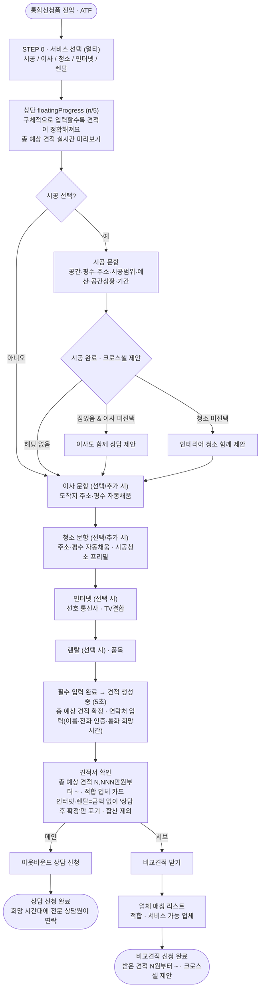

# 신청폼 정보 매트릭스 정책 문서

> 출처(Notion): [🗂 신청폼 정보 매트릭스 정책 문서](https://app.notion.com/p/ohouse/3a5a597878a081fea0f9ef5a124282c9)
> 상위: [📔 [1Pager] 시공생활 통합신청 플로우](https://app.notion.com/p/ohouse/3a5a597878a0804281a6e85747cdd1d0)
> 이 문서는 프로토타입(`o2o_prototype_ods.html`)의 **02 서비스 선택 ~ 08 신청 완료** 플로우 ground truth 입니다. **파트너 확정 이후(09~11) 플로우는 범위에서 제외**합니다.

---

## 01. 통합 응답 문항 플로우

- 선택한 서비스에 따른 **필수 정보 입력**을 받는다.
- 서비스별 입력 순서는 **종합시공 or 부분시공 > 이사 > 이사청소 > 인터넷 > 렌탈** 순이다.
- 앞서 받은 입력 항목은 다음 입력 항목으로 **prefill** 하고 입력을 스킵한다.
- 세부 항목 옵션 입력은 **single select chip** 을 디폴트로 한다. 일부 항목은 multimodal 형식으로 받는다.
- `[직접 입력]` 등 옵션 선택 시에도 multimodal 형식으로 정보를 입력받는다.
- 서비스 선택 직후 모든 필수 정보 항목값을 카운트하여 **상단 고정 progress block** 에 단계를 표시하며, 입력을 완수할 때마다 round progress 를 **n/총합 만큼(1/n 씩) fill** 한다.
- 모든 필수 정보 입력을 받은 직후 **"견적 생성중" 로딩 블록**을 채팅창에 표시한다(5초 강제 duration). 이 시점에 바로 **연락처 입력 블록 + 액션 버튼**을 노출한다.
- 견적 생성 완료 시 상단 progress block 을 **check 상태**로 전환하며 **[상담신청]** 버튼을 노출한다.
- [상담신청] 클릭 → **견적서 확인** 화면 이동 → 총 예상 견적·적합 업체 카드 확인 후 **아웃바운드 상담 신청(메인)** 또는 **비교견적 받기(서브)** 로 분기한다.

---

## A. 선택 서비스별 필수 정보 항목

| 서비스 | 필수 정보 항목 | 분기 · 입력 순서 |
|---|---|---|
| **공통 (연락처)** | 이름 · 전화번호(인증필요) · 통화희망시간 | 견적서 생성 완료 직후 · 1회 |
| **종합시공** | 평수 · 시공 주소 · 예산-종합시공 · 시공 희망범위 · 공간상황 · 시공일정 | 공간상황=짐있음 → 이사 제안 / 시공 완료 → 청소 제안 |
| **부분시공** | 평수 · 시공 주소 · 예산-부분시공 · 시공 희망범위 · 공간상황 · 시공일정 | 공간상황=짐있음 → 이사 제안 / 시공 완료 → 청소 제안 |
| **이사** | 이사 예정일&선호 시간대 · 출발지 · 도착지 · 이사유형 · 포장 종류 | 시공에서 받은 평수·시공주소가 있으면 이사 '도착지' prefill |
| **이사청소** | 청소 희망일&선호 시간대 · 주소지 · 방 개수 · 베란다 개수 · 화장실 개수 | 시공에서 받은 평수·시공주소가 있으면 이사청소 '주소지' prefill |
| **인터넷** | 선호 통신사 · TV결합 여부 | — |
| **렌탈** | 렌탈품목 | — |

## B. 세부 항목 옵션

| 서비스 | 항목 | single select chip | multimodal |
|---|---|---|---|
| 시공-공통 | 시공희망범위(다중) | — | multi: 도배 / 마루·장판 / 주방 / 욕실 / 도어·문틀 / 창호·샷시 / 발코니 확장 / 시스템에어컨 |
| 시공-공통 | 공간 상황 | 현재 공실 / 시공 시 공실 예정 / 시공 시 짐(일부) 있을 예정 | — |
| 시공-공통 | 시공희망일정 | 시작일-종료일 | calendar picker (start-end) |
| 시공-종합 | 평수 | 10평 이하 / 10평대 / 20평대 / 30평대 / 40평대 / 60평대 이상 | — |
| 시공-종합 | 예산-종합시공 | 500만원 이하 / 1000만원대 / 2000만원대 / 상담 후 결정 / 직접입력 | 직접입력 → text |
| 시공-부분 | 예산-부분시공 | 100만원 미만 / 100만원대 / 200만원대 / 300만원대 / 400만원대 / 상담 후 결정 / 직접입력 | 직접입력 → text |
| 이사 | 이사예정일 | NN.NN.NN | calendar (single) |
| 이사 | 선호시간대 | 아침(9시 이전) / 오전(9-12시) / 오후(12-18시) / 저녁(18시 이후) / 직접입력 | 직접입력 → text |
| 이사 | 평수 | 10평 이하 / 10평대 / 20평대 / 30평대 / 40평대 / 50평대 / 60평 이상 | — |
| 이사 | 포장 종류 | 포장이사 / 반포장이사 / 일반이사 | list (title+subtitle) |
| 이사 | 짐 정보 입력 | 사진·영상 첨부 / 건너뛰기 | gallery picker (max 5) |
| 이사청소 | 청소희망일 | 이사/시공 다음날 옵션 + 날짜 선택 | calendar (single) |
| 이사청소 | 선호 시간대 | 아침/오전/오후/저녁/직접입력 | — |
| 이사청소 | 방 개수 | 원룸 / 1.5룸 / 2룸 / 3룸 / 4룸 / 5룸 이상 | — |
| 이사청소 | 베란다 개수 | 없음 / 1 / 2 / 3개 이상 | — |
| 이사청소 | 화장실 개수 | 없음 / 1 / 2 / 3개 이상 | — |
| 인터넷 | TV 결합 | 결합 / 미결합 | — |
| 렌탈 | 품목 카테고리 | 정수기 / 공기청정기 / 비데 / 매트리스 | — |
| 연락처 | 이름 | 한글 이름 | — |
| 연락처 | 연락처 | 전화번호 NNN-NNNN-NNNN | number input |
| 연락처 | 통화가능시간 | 아침/오전/오후/저녁/직접입력 | — |
| 연락처 | 세부 요청사항 | 텍스트 500자 이내 | text input |

## C. 총 예상 견적

- 견적은 **최소가만 "N,NNN만원부터~"** 로 노출하고 "예상 시작가 · 정확한 금액은 상담에서 확정" 라벨을 함께 단다. **상한은 화면에 노출하지 않는다.**
- 표시 최소가 = 각 서비스 단가 룰(C-2)의 **하한(min)** 으로 산출하며, 여러 서비스 선택 시 **최소가끼리 합산**해 "합계 N,NNN만원부터~" 로 노출한다.
- 예산 **'상담 후 결정'** 이거나 값이 비면 **평수 기반 최소가**로 대체 추정하고, **'직접입력'** 값이 있으면 그 값을 최소가 앵커로 반영한다. 산출 불가 서비스는 "상담 시 안내".
- **인터넷·렌탈은 월 구독형**이라 견적서에 금액 없이 **"상담 후 확정"으로만 표기**하고 일시금 합산에는 미포함한다.

### C-1. 예시 시나리오 (20평대 신축 입주 · 전체시공 + 이사 + 이사청소 + 인터넷)

| 서비스 | 견적 산출 입력값 | 예상 견적(최소가) | 유형 |
|---|---|---|---|
| 전체시공 | 20평대 · 도배·마루·주방·욕실 · 예산 '상담 후 결정' · 시공 시 공실 예정 | **2,500만원부터~** | 일시금 |
| 이사 | 20평대 · 포장이사 · 짐 보통 | **90만원부터~** | 일시금 |
| 이사청소 | 20평대 · 방 3 · 베란다 2 · 화장실 2 | **20만원부터~** | 일시금 |
| 인터넷 | KT · TV 결합 · 3년 약정 | 상담 후 확정 | 월 구독 |
| **합계 (일시금 · 인터넷·렌탈 제외)** | — | **약 2,610만원부터~** | — |

### C-2. 서비스별 견적 산출 기준

| 서비스 | 핵심 변수 | 산출 룰(목업) |
|---|---|---|
| 종합시공 | 평수 × 평당단가 | 평당 100만~160만원 |
| 부분시공 | 선택 분야별 단가 합산 | 도배 평당 3~5만 · 마루 평당 8~12만 · 주방 300~800만 · 욕실 250~450만/개 · 창호 25~60만/개 |
| 이사 | 평수 구간 기본요금 × 포장 계수 | 포장(20평대) 90~140만 · 반포장 ×0.65 · 일반 ×0.45 |
| 이사청소 | 평수 기본 + 옵션 가산 | 평당 0.8~1.2만 + 화장실 4만/개 + 베란다 2만/개 |

---

## 프로토타입 반영 상태 (`o2o_prototype_ods.html`)

- **02 서비스 선택**: 멀티 선택 리스트 + 부분시공 시공범위 타일 (`VIEW.select`)
- **04 정보 입력(챗봇)**: 상단 floatingProgress(n/총합, 1/n fill) + 정책 A/B 문항 매트릭스(`QMX`) + 크로스셀(짐있음→이사 / 시공→청소) + 인라인 "견적 생성중"→price 버블 + 맞춤상담 제안 + 연락처(번호·희망시간) (`VIEW.form`)
- **총 예상 견적(C)**: 최소가 합산, 인터넷·렌탈 "상담 후 확정" 합산 제외 (`estMin`)
- **05 견적서 확인 → 아웃바운드 상담 / 비교견적**: `VIEW.branch` 이후 (별도 트랙)
- **파트너 확정 이후(09~11)**: **삭제됨** — 정책·본 프로토타입 범위 밖
